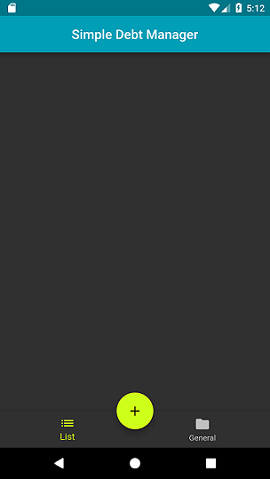

# simple_debt_manager

Small project to learn flutter where you can manage your debts.

This project started as a joke. 

Debts are onesided.

## Description

Create debts and store them in a small sqlite database.

Edit/delete those debts.

See a general info tab with a resume.

## Plugins used
- [sqflite](https://pub.dartlang.org/packages/sqflite)
- [charts_flutter](https://pub.dartlang.org/packages/charts_flutter)
- [flutter_launcher_icons](https://pub.dartlang.org/packages/flutter_launcher_icons)

## Future
- Filter the list by users or quantity

## Known bugs
- DataHolder not updating properly when a new debt is added